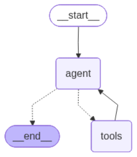

# 🏨 Agentic Hotel Assistant (LangGraph & RAG)

An advanced, conversational AI agent designed to manage hotel operations, answer guest inquiries, and process room bookings. Built with **LangGraph**, **LangChain**, and **OpenAI**, this agent dynamically routes between a Retrieval-Augmented Generation (RAG) system for hotel policies and an SQLite database for live room availability and booking management.

## 🌟 Key Features

* **ReAct Agent Architecture**: Powered by LangGraph, the agent intelligently decides when to query the knowledge base, when to execute SQL transactions, and when to simply converse with the user.
* **RAG Knowledge Base**: Uses **FAISS** and OpenAI Embeddings to search through unstructured hotel documents (policies, amenities, restaurant schedules).
* **Live SQL Integration**: Interfaces with a simulated `hotel.db` SQLite database to check room availability, retrieve booking details, and securely insert new bookings.
* **Persistent Conversation Memory**: Maintains context across multi-turn interactions, seamlessly remembering guest names, desired dates, and room preferences.

## 🏗️ System Architecture

The agent follows a cyclical state graph where the LLM evaluates the user's input, binds available tools, and executes them only when necessary. 



### Tool Kit
1. `search_hotel_info`: Queries the FAISS vector store for unstructured hotel FAQ data.
2. `check_room_availability`: Executes SQL `SELECT` queries to find available rooms by type.
3. `get_booking_details`: Joins `bookings` and `rooms` tables to fetch existing guest reservations.
4. `book_room`: Executes SQL `INSERT` and `UPDATE` statements to lock a room and generate a booking ID.

## 💻 Tech Stack

* **Core AI**: LangChain, LangGraph, OpenAI (`gpt-4o-mini`, `text-embedding-3-small`)
* **Vector Store**: FAISS
* **Database**: SQLite3
* **Environment**: Python, Jupyter Notebook

## 🚀 Setup & Installation

**1. Clone the repository**
```bash
git clone https://github.com/goalgamal/agentic-hotel-assistant.git
cd agentic-hotel-assistant
```

**2. Create a virtual environment**
```bash
python -m venv venv
source venv/bin/activate  # On Windows use: venv\Scripts\activate
```

**3. Install dependencies**
```bash
pip install -r requirements.txt
```

**4. Set up environment variables**
Copy the example .env file and add your OpenAI API key:

```bash
cp .env.example .env
```

**5. Initialize the Data (If needed)**

If you haven't generated the database and vector store yet, run the setup notebook first:

* **`notebooks/notebook_1_setup.ipynb`**: Generates the fake hotel documents, FAISS vector store, and `hotel.db`.

**6. Run the App**
Launch the Streamlit interface:

```bash
streamlit run app.py
```

**💬 Usage Example**

The agent handles end-to-end booking flows, handling interruptions and multi-step reasoning seamlessly.

## 👨‍💻 Author
### Goal Gamal
AI Engineer | LLM Specialist | Data Scientist
